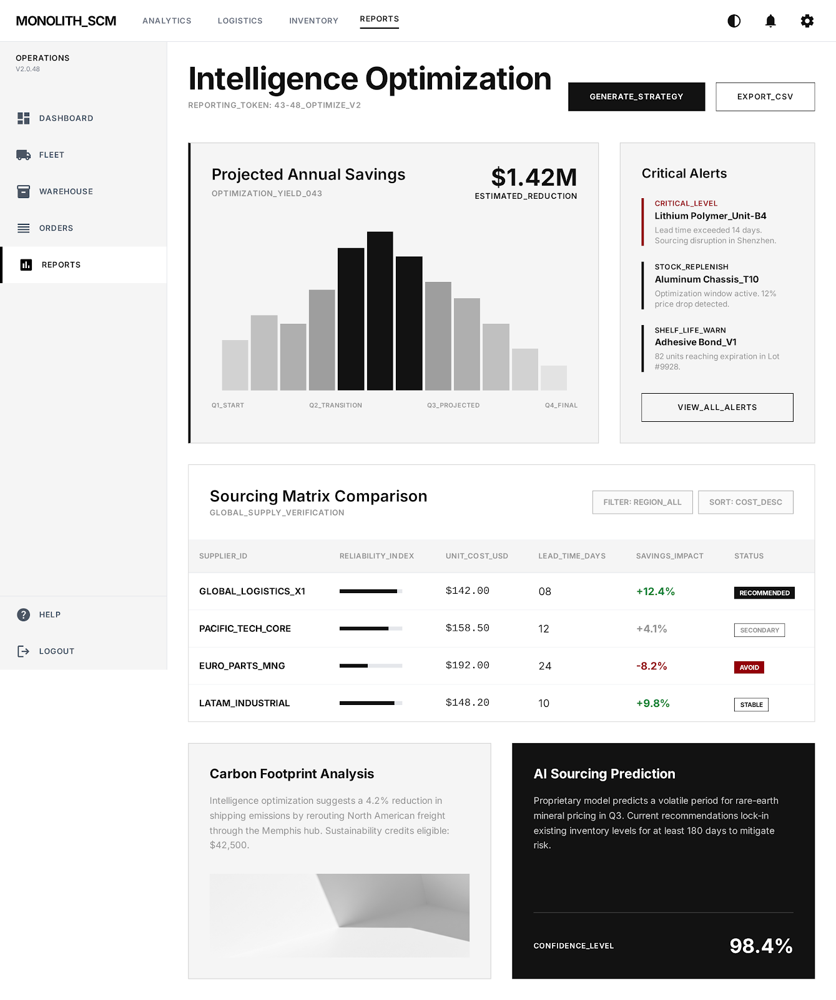
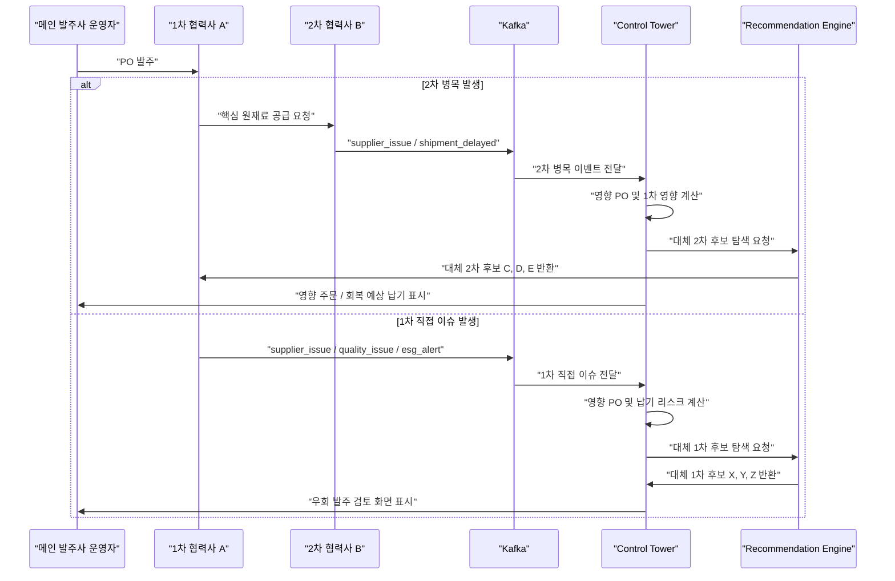
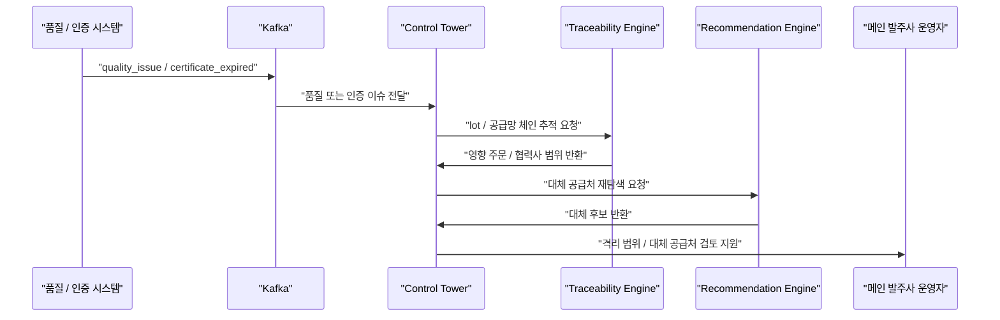
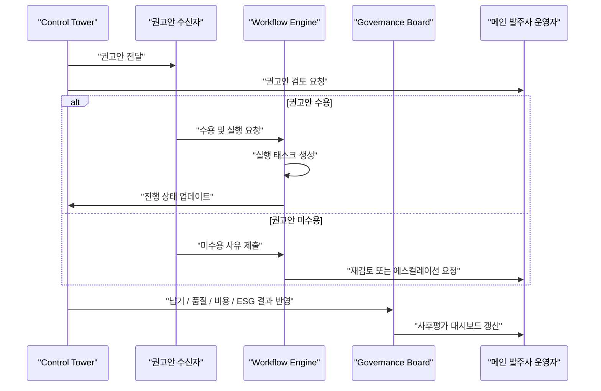
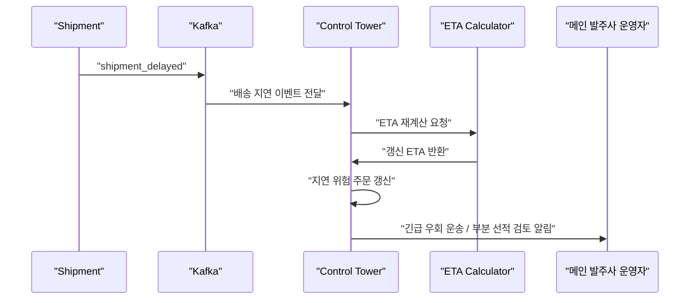
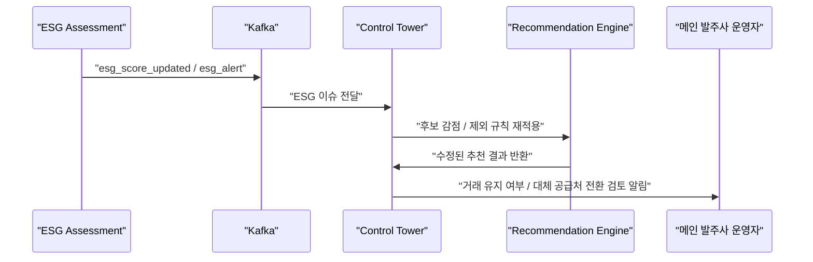
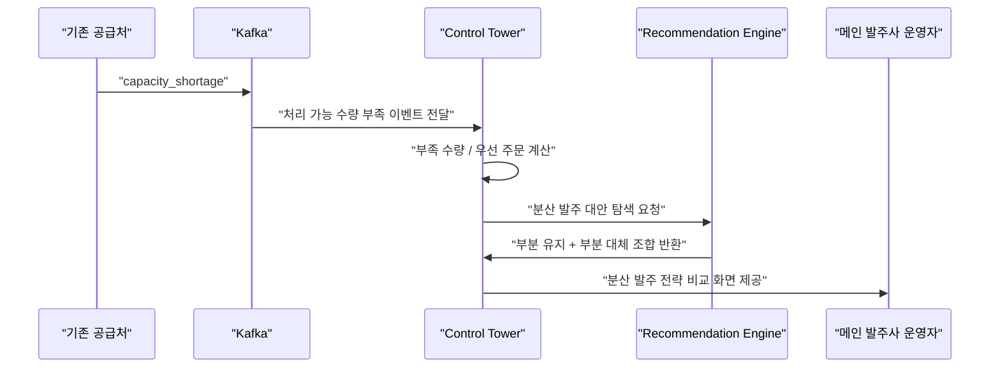

# 공급망 리스크 오케스트레이션 및 협력사 거버넌스 시스템

<div class="card">
    <h2>소개</h2>
    <p align="center">
      Atlas는 공급망 운영 과정에서 흩어져 관리되던 발주·재고·출하·반품 데이터를 하나의 업무 흐름으로 연결하기 위해 설계된,
    </p>
    <p align="center">
      <strong>통합 SCM 주문 관리 시스템</strong>입니다.
    </p>
    <p align="center">
      기업은 Atlas를 통해 발주 이후 발생하는 재고 변동, 출하 진행, 반품 처리까지 한 번에 추적할 수 있으며,
    </p>
    <p align="center">
      공급망 운영의 가시성과 추적성을 높이고 주문 이후 발생하는 리스크까지 체계적으로 관리할 수 있습니다.
    </p>
  </div>

<h2 id="toc">목차</h2>
  <div class="toc">
  <a href="#team">1. 팀원</a><br />
  <a href="#project-plan">2. 프로젝트 기획서</a><br />
  <a href="#analysis-design">3. 분석 및 설계</a><br />
  <a href="#techstack">4. 기술 스택</a><br />
  <a href="#architecture">5. 시스템 아키텍처</a><br />
  <a href="#tech-summary">6. 기술 요약</a><br />
  <a href="#features">7. 주요 기능</a><br />
  <a href="#ui-ux-test">8. 기능 시연 영상</a><br />
  </div>

<section id="team">
<h2>1. 팀원 소개</h2>

|                                                                        **김태환**                                                                         |                                                    **김도균**                                                    |                                                        **이병찬**                                                         |                                                                       **조강**                                                                        |                                                                      **황정윤**                                                                      |
|:------------------------------------------------------------------------------------------------------------------------------------------------------:|:-------------------------------------------------------------------------------------------------------------:|:----------------------------------------------------------------------------------------------------------------------:|:----------------------------------------------------------------------------------------------------------------------------------------------------:|:-------------------------------------------------------------------------------------------------------------------------------------------------:|
| [ <br/> @iamxoghks <br/>](https://github.com/iamxoghks) | [ <br/> @kimdogyun <br/>](https://github.com/kimdogyun) | [ <br/> @2001056 <br/>](https://github.com/2001056) |          [ <br/> @ybrocks <br/>](https://github.com/ybrocks)           |      [ <br/> @yune22<br/>](https://github.com/yune22)       |
</section>

<section id="project-plan">
    <h2>2. 프로젝트 기획서</h2>
    
  <h3>1) 문제정의 & 가치제안</h3>
  <details>
    <summary><b>①.1 문제정의</b></summary>
    <p>
    식자재와 같은 공급망 운영은 하나의 발주로 끝나는 단순 주문 업무가 아니라,
    <strong>품목 등록, 공급사 관리, 발주, 재고, 출하, 반품/교환, 정산</strong>이 연속적으로 이어지는 복합 업무이다.
    그러나 실제 현장에서는 이 과정이 여러 시스템, 엑셀, 메신저, 전화, 수기 문서로 분산되어 관리되는 경우가 많다.
    이로 인해 발주 이후 어떤 공급사가 어떤 품목을 얼마나 준비했는지, 재고가 충분한지, 출하가 지연되고 있는지,
    반품 처리가 어디까지 진행되었는지를 한눈에 파악하기 어렵다.
  </p>
    
    <p>
  특히 메인 발주사가 여러 공급사에 발주를 넣는 구조에서는
  <strong>각 공급사의 발주 수락 여부, 공급 가능 수량, 재고 상태, 출하 진행 상황을 한눈에 파악하기 어려운 문제</strong>가 발생한다.
  특정 품목의 생산 가능 수량, 최소 주문 수량, 리드타임, 유통기한, 인증 정보, 보관 조건 등이 분산되어 있으면
  발주 시점에는 문제가 없어 보이더라도 실제 출하 단계에서 재고 부족, 납기 지연, 품질 이슈가 뒤늦게 드러날 수 있다.
</p>
    
    <p>
    기존 주문 관리 방식의 또 다른 한계는
    <strong>발주 이후의 후속 업무가 주문 데이터와 느슨하게 연결되어 있다는 점</strong>이다.
    발주가 확정되었음에도 품목 정보가 수정되거나, 재고 상태와 출하 상태가 별도로 관리되거나,
    반품/교환 처리 결과가 정산 데이터와 바로 연결되지 않으면 데이터 정합성이 깨진다.
    이는 단순한 관리 불편을 넘어, 실제 업무에서는 오배송, 중복 발주, 재고 오차, 정산 오류로 이어질 수 있다.
  </p>
    
    <p>
    또한 식자재 공급망은 일반 상품보다 운영 리스크가 크다.
    품목별로 <strong>원산지, 인증, 유통기한, 보관 조건, 제조일, 창고 위치</strong>와 같은 세부 정보가 중요하며,
    반품이나 교환이 발생했을 때도 사유, 검수 결과, 증빙 이미지, 처리 상태가 체계적으로 남아야 한다.
    하지만 이러한 정보가 발주 시스템과 분리되어 있으면 담당자는 필요한 정보를 매번 수동으로 확인해야 하고,
    문제 발생 시 원인 추적과 책임 소재 파악이 늦어진다.
  </p>
    <p>
    요약하면 공급망 주문 관리에는 다음과 같은 구조적 한계가 존재한다:
  </p>
<ul>
    <li>① 발주, 재고, 출하, 반품, 정산이 분리 관리되어 업무 흐름이 끊김</li>
    <li>② 메인 발주사가 하위 공급사의 준비 상황과 지연 원인을 즉시 파악하기 어려움</li>
    <li>③ 품목, 인증, 원산지, 유통기한, 보관 조건 등 핵심 정보가 흩어져 추적성이 낮음</li>
    <li>④ 확정 발주 이후에도 품목/재고 데이터가 일관되게 통제되지 않으면 데이터 정합성이 깨짐</li>
    <li><strong>⑤ 실무형 SCM 확장성</strong> - 여러 공급사와 품목을 관리하는 공급망 주문 업무로 확장 가능</li>

  </ul>
<p>
    이러한 문제는 단순한 화면 불편이 아니라,
    <strong>공급망 운영의 가시성, 정확성, 추적성을 떨어뜨리고 지연·부족·반품 리스크 대응을 늦추는 핵심 원인</strong>으로 작동한다.
  </p>

</details>

<details>
  <summary><b>①.2 가치제안</b></summary>
  <p>
    ATLAS는 이러한 문제를 해결하기 위해 설계된
    <strong>공급망 관리를 위한 통합 주문 관리 시스템</strong>이다.
    발주, 품목, 공급사, 재고, 출하, 반품/교환, 정산 데이터를 하나의 업무 흐름으로 연결하여
    주문 이후의 모든 운영 상태를 추적하고 관리할 수 있도록 지원한다.
  </p>
  
  <p>
    ATLAS의 핵심 가치는 단순히 발주서를 생성하는 것이 아니라,
    <strong>발주 이후 실제 공급망에서 발생하는 업무 변화를 데이터로 연결하는 것</strong>이다.
    사용자는 품목별 공급 가능 수량, 최소 주문 수량, 리드타임, 창고별 재고, 출하 상태, 반품 처리 상태,
    정산 정보를 같은 흐름 안에서 확인할 수 있다.
    이를 통해 발주사는 공급사와의 업무 진행 상황을 더 명확하게 파악하고,
    공급사는 요청받은 발주와 출하, 반품 대응을 체계적으로 관리할 수 있다.
  </p>
<p>
    특히 ATLAS는 식자재 공급망 MVP 시나리오에 맞춰
    <strong>품목, 인증, 원산지, 유통기한, 보관 조건, 제조일, 재고 Lot, 반품 증빙 이미지</strong> 등
    실무에서 중요한 세부 데이터를 관리할 수 있도록 구성했다.
    이 데이터들은 단순 참고 정보가 아니라 발주, 재고, 출하, 반품 판단에 직접 연결되는 운영 데이터로 활용된다.
  </p>

<p>
    또한 ATLAS는 발주가 확정된 이후 관련 품목이 임의로 수정되지 않도록 제한하고,
    재고와 출하 상태가 발주 흐름과 연결되도록 설계했다.
    이를 통해 업무 단계별 데이터 정합성을 확보하고,
    운영자가 잘못된 기준 정보로 발주나 출하를 처리하는 문제를 줄일 수 있다.
  </p>
  <p>
    ATLAS가 제공하는 주요 가치는 다음과 같다:
  </p>
  

  <ul>
    <li><strong>① 통합 가시성</strong> - 발주, 재고, 출하, 반품, 정산 상태를 하나의 흐름으로 확인</li>
    <li><strong>② 운영 정확성</strong> - 품목, 공급 가능 수량, MOQ, 리드타임, 재고 데이터를 기준으로 주문 처리</li>
    <li><strong>③ 추적성 확보</strong> - 주문 이후 출하, 반품/교환, 정산까지 단계별 이력 관리</li>
    <li><strong>④ 데이터 정합성 강화</strong> - 확정 발주 이후 품목 수정 제한 등 업무 규칙 반영</li>
    <li><strong>⑤ 실무형 SCM 확장성</strong> - 식자재뿐 아니라 다중 공급사 구조를 가진 공급망 업무로 확장 가능</li>
  </ul>
<p>
    결국 ATLAS는
    <strong>발주부터 납품, 재고, 반품, 정산까지 하나의 흐름으로 연결해 공급망 운영을 효율화하는 SCM 플랫폼</strong>이다.
    단절된 주문 관리 방식에서 벗어나,
    공급사 협업과 운영 이력을 체계적으로 관리함으로써
    <strong>공급망 운영의 가시성과 업무 신뢰성을 높이는 운영 중심 주문 관리 시스템</strong>을 제안한다.
  </p>
</details>

<h3>2) 핵심 기능 요약</h3>
<div id="features">
  <details>
    <summary><b>②.1 요약</b></summary>

  <table>
      <thead>
        <tr>
          <th>영역</th>
          <th>주요 기능</th>
        </tr>
      </thead>
      <tbody>
        <tr>
          <td><strong>관리자</strong></td>
          <td>사용자 계정 관리, 조직 관리, 권한 관리, 품목 카테고리 관리, 인증서 유형 관리, 공급망 운영 데이터 조회, 발주·재고·출하·반품·정산 상태 확인</td>
        </tr>
        <tr>
          <td><strong>조직관리</strong></td>
          <td>발주사/공급사 조직 등록·조회·수정, 조직별 사용자 연결, 조직 유형별 업무 권한 관리, 담당자 및 연락처 정보 관리</td>
        </tr>
        <tr>
          <td><strong>품목</strong></td>
          <td>품목 등록·조회·수정, 카테고리 연결, 단가·규격·단위·유통기한 관리, 월간 생산량·주문 가능 수량·최소 주문 수량·리드타임 관리, 품목 이미지/파일 관리, 확정 발주 품목 수정 제한</td>
        </tr>
        <tr>
          <td><strong>인증서</strong></td>
          <td>공급사 인증서 등록·조회, 인증서 유형 관리, 원산지·품질·보관 조건 등 식자재 공급망 검증 자료 관리, 인증서 파일 업로드/조회</td>
        </tr>
        <tr>
          <td><strong>물류거점</strong></td>
          <td>창고·센터·출발지·도착지 등 물류거점 등록·조회·수정, 주소·좌표·담당 조직 관리, 출하 생성 시 출발/도착 거점 연동, 지도 기반 위치 시각화</td>
        </tr>
        <tr>
          <td><strong>재고</strong></td>
          <td>재고 등록·조회·수정, 품목별/창고별 재고 조회, 제조일·유통기한·잔여 수량·예약 수량·주문 가능 수량 관리, 품목 상세 내 해당 품목 재고 상태 표시</td>
        </tr>
        <tr>
          <td><strong>발주</strong></td>
          <td>발주 생성·목록 조회·상세 조회, 발주 품목 및 요청 수량 관리, 공급사 발주 수락·반려·부분 확정, 확정 수량 관리, 발주 상태 전환 및 후속 출하/정산 흐름 연결</td>
        </tr>
        <tr>
          <td><strong>출하</strong></td>
          <td>확정 발주 기반 출하 생성, 출하 목록·상세 조회, 출발/도착 물류거점 연결, 배송 상태 및 ETA 관리, 지도 기반 출하 흐름 시각화</td>
        </tr>
        <tr>
          <td><strong>반품/교환</strong></td>
          <td>반품 요청 등록, 반품 품목 선택, 반품 사유 및 증빙 이미지 첨부, 검수 결과 등록, 교환·폐기·반품 완료 처리, 반품/교환 상태 추적</td>
        </tr>
        <tr>
          <td><strong>정산</strong></td>
          <td>정산 목록·상세 조회, 정산 기간·금액·상태 관리, 발주·출하·반품 결과와 연결된 정산 데이터 확인, 공급사별 정산 흐름 관리</td>
        </tr>
        <tr>
          <td><strong>알림/채팅</strong></td>
          <td>발주·출하·반품·정산 상태 변경 알림, 이메일 알림 연동, 발주사와 공급사 간 업무 협의를 위한 실시간 채팅, WebSocket/STOMP 기반 메시지 송수신</td>
        </tr>
        <tr>
          <td><strong>프로필</strong></td>
          <td>내 정보 조회·수정, 비밀번호 변경, 소속 조직 및 권한 확인, 사용자별 접근 가능 업무 확인</td>
        </tr>
      </tbody>
    </table>
  </details>
</div>

<h3>3) 공급망형 주문관리(SCM Order Management) 흐름</h3>
<div id="order-supply">
  <details>
    <summary><b>③.1 흐름</b></summary>

  <ol>
      <li>
        <strong>기준 정보 등록:</strong>
        조직 등록 → 사용자/권한 설정 → 물류거점 등록 → 품목 카테고리 등록 → 인증서 유형 등록
      </li>
      <li>
        <strong>공급 정보 구성:</strong>
        공급사 등록 → 품목 등록 → 단가·규격·유통기한 입력 → 월간 생산량·주문 가능 수량·MOQ·리드타임 설정 → 인증서/원산지/보관 조건 자료 등록
      </li>
      <li>
        <strong>발주 요청:</strong>
        발주사가 공급사와 품목을 선택 → 요청 수량·납기일 입력 → 발주 생성 → 공급사에게 발주 요청 전달
      </li>
      <li>
        <strong>발주 처리:</strong>
        공급사가 발주 상세 확인 → 수락/반려/부분 확정 처리 → 품목별 확정 수량 입력 → 발주 상태 전환
      </li>
      <li>
        <strong>재고 연동:</strong>
        확정 발주 기준으로 재고 확인 → 품목별/창고별 재고 상태 조회 → 잔여 수량·예약 수량·주문 가능 수량 관리
      </li>
      <li>
        <strong>출하 처리:</strong>
        확정 발주 기반 출하 생성 → 출발/도착 물류거점 지정 → 배송 상태 및 ETA 관리 → 지도 기반 출하 흐름 확인
      </li>
      <li>
        <strong>납품 이후 처리:</strong>
        납품 완료 후 품질 이슈 또는 수량 불일치 발생 시 반품/교환 요청 → 반품 품목 선택 → 사유 및 증빙 이미지 등록 → 검수 결과 입력 → 교환/폐기/반품 완료 처리
      </li>
      <li>
        <strong>정산:</strong>
        발주·출하·반품 결과를 기반으로 정산 데이터 확인 → 공급사별 정산 금액·기간·상태 관리 → 정산 완료 처리
      </li>
      <li>
        <strong>운영 커뮤니케이션:</strong>
        발주, 출하, 반품, 정산 상태 변경 시 알림 발송 → 발주사와 공급사 간 채팅으로 업무 협의 → 처리 이력 확인
      </li>
    </ol>
  </details>
</div>

<h3>4) 발표 시나리오</h3>
<div id="demo">
  <details>
    <summary><b>④.1 시나리오</b></summary>

  <ol>
      <li>
        <strong>관리자 기준 정보 세팅</strong>
        물류거점, 품목 카테고리, 인증서 유형, 조직/사용자 정보를 등록하여 공급망 운영의 기본 데이터를 구성한다.
      </li>
      <li>
        <strong>공급사 품목 등록</strong>
        공급사가 품목명, 단가, 규격, 유통기한, 월간 생산량, 주문 가능 수량, 최소 주문 수량, 리드타임을 등록하고 인증서 및 품목 이미지를 첨부한다.
      </li>
      <li>
        <strong>발주사 발주 생성</strong>
        발주사가 공급사와 품목을 선택하고 요청 수량과 납기일을 입력해 발주를 생성한다.
      </li>
      <li>
        <strong>공급사 발주 처리</strong>
        공급사는 발주 상세를 확인한 뒤 수락, 반려 또는 부분 확정을 선택하고 품목별 확정 수량을 입력한다.
      </li>
      <li>
        <strong>확정 발주 이후 품목 수정 제한</strong>
        발주가 확정된 품목은 수정할 수 없도록 제한되어, 발주 기준 정보가 임의로 변경되지 않음을 확인한다.
      </li>
      <li>
        <strong>재고 확인 및 출하 생성</strong>
        확정된 발주를 기준으로 해당 품목의 재고를 확인하고, 출발/도착 물류거점을 지정하여 출하를 생성한다.
      </li>
      <li>
        <strong>지도 기반 출하 상태 확인</strong>
        출하 상세 화면에서 배송 상태, ETA, 물류거점 정보를 확인하고 지도 기반으로 출하 흐름을 시각적으로 확인한다.
      </li>
      <li>
        <strong>반품/교환 요청</strong>
        납품 이후 품질 문제 또는 수량 불일치가 발생한 상황을 가정하여 반품 품목을 선택하고 사유와 증빙 이미지를 등록한다.
      </li>
      <li>
        <strong>반품 검수 및 처리</strong>
        공급사가 반품 요청을 확인하고 검수 결과를 등록한 뒤 교환, 폐기 또는 반품 완료 상태로 처리한다.
      </li>
      <li>
        <strong>정산 확인</strong>
        발주, 출하, 반품 처리 결과를 기반으로 공급사별 정산 목록과 상세 금액, 처리 상태를 확인한다.
      </li>
      <li>
        <strong>알림/채팅 확인</strong>
        발주, 출하, 반품, 정산 상태 변경에 따른 알림과 발주사-공급사 간 업무 채팅 흐름을 확인한다.
      </li>
    </ol>
  </details>
</div>


</section>

<section id="analysis-design">
  <h2>3. 분석 및 설계</h2>
  
  ### 요구사항 명세서 [상세보기](https://docs.google.com/spreadsheets/d/1-9XXxS_f5A81Zk5Z6et8IepxUo-Pm2fp-omdqqYuDvY/edit?gid=0#gid=00)
  <details>
    <summary><b>요구사항 명세서</b></summary>
    
    
    
  </details>

  ### 화면 설계서 [상세보기](https://stitch.withgoogle.com/projects/3858843644991271330)
  <details>
    <summary><b>화면 설계서</b></summary>
    
  </details>
  
  ### ERD [상세보기](https://www.erdcloud.com/d/CTyFQXjoQ3my9vYvr)
  <details>
    <summary><b>ERD</b></summary>
    
  </details>

  ### WBS [상세보기](https://docs.google.com/spreadsheets/d/1-9XXxS_f5A81Zk5Z6et8IepxUo-Pm2fp-omdqqYuDvY/edit?gid=176847268#gid=176847268)
  <details>
    <summary><b>WBS</b></summary>
    
    
    
    
    
    
    
  </details>

  ### API 명세서 [상세보기](https://docs.google.com/spreadsheets/d/1-9XXxS_f5A81Zk5Z6et8IepxUo-Pm2fp-omdqqYuDvY/edit?gid=1910787508#gid=1910787508)
  <details>
    <summary><b>API 명세서</b></summary>
    
    
    
    
    
  </details>
</section>

<section id="techstack">
  <h2>4. 기술 스택</h2>
  <div class="card">

  <div align="center"><h3>Backend</h3></div>
  <div align="center">
      
      
      
      
      
      
      
      
      
      
      
      <br>

  <div align="center"><h3>Frontend</h3></div>
      
      
      
      
      
      
      
      
      
  <br>

  <div align="center">
      <h3>Infra & Cloud</h3>
      
      
      
      
      
      
      
      
      
      
    </div>

  <div align="center">
      <h3>External API & Integration</h3>
      
      
      
      
      
    </div>

  <div align="center">
      <h3>Test & Docs</h3>
      
      
      
      
      
    </div>

  <div align="center">
      <h3>Tools & Collaboration</h3>
      
      
      
      
      
    </div>

  </div>
</section>

<section id="architecture">
  <h2>5. 시스템 아키텍처</h2>
  <h3> 시스템 배포 아키텍처 </h3>
    
  
  <h3> SCM 비즈니스 흐름도 </h3>
  

  
</section>

<section id="tech-summary">
  <h2>6. 기술 요약</h2>
<table>
  <thead>
    <tr>
      <th>사용기술</th>
      <th>설명</th>
    </tr>
  </thead>
  <tbody>
    <tr>
        <td><b>Spring Boot 기반 MSA 도메인 분리 구조</b></td>
        <td>ATLAS는 인증, 공급망 운영, 파일, 관제 기능을 각각 Auth Service, Supply Service, File Service, Control Service로 분리한 MSA 구조로 설계했습니다. 각 서비스는 독립적인 책임을 가지며 API Gateway를 통해 외부 요청을 라우팅합니다. 특히 Supply Service는 품목, 공급사, 발주, 재고, 출하, 반품, 정산 등 SCM 핵심 도메인을 담당하고, 공통 예외 처리와 응답 구조는 Common Module로 분리하여 서비스 간 중복 구현을 줄였습니다.</td>
    </tr>
    <tr>
      <td><b>발주-재고-출하-반품-정산 통합 업무 흐름</b></td>
      <td>공급망 운영에서 분리되어 관리되기 쉬운 발주, 재고, 출하, 반품/교환, 정산 데이터를 하나의 흐름으로 연결했습니다. 발주가 확정되면 품목 수정 제한과 재고 예약, 출하 상태 관리 등 후속 업무에 영향을 주도록 설계해 데이터 정합성을 높였습니다. 이를 통해 사용자는 주문 이후의 처리 상태를 단계별로 추적하고, 공급사와 발주사 간 업무 진행 상황을 한눈에 확인할 수 있습니다.</td>
    </tr>
    <tr>
        <td><b>Spring Data JPA 기반 도메인 데이터 관리</b></td>
        <td>품목, 공급사, 발주, 재고, 출하, 반품, 정산 등 주요 도메인은 Spring Data JPA 기반으로 관리했습니다. Entity 간 연관관계를 통해 주문 품목, 공급사 품목, 재고 Lot, 출하, 반품 품목 등 업무 데이터를 구조화했으며, 공통 BaseTimeEntity를 활용해 생성일과 수정일을 일관되게 기록합니다. 또한 Public ID 기반 식별자를 사용하여 내부 DB ID 노출을 줄이고 API 사용 안정성을 높였습니다.</td>
      </tr>
      <tr>
        <td><b>Redis 기반 인증 보조 및 캐시 처리</b></td>
        <td>Redis는 인증 흐름과 서비스 성능 보조를 위한 인메모리 저장소로 활용했습니다. 빠른 조회가 필요한 인증 관련 데이터나 반복 조회되는 데이터를 Redis에 저장하여 DB 접근 부담을 줄이고, 사용자 요청 처리 속도를 개선했습니다. 이를 통해 로그인, 권한 확인, 세션성 데이터 처리 등에서 안정적인 응답 구조를 구성했습니다.</td>
      </tr>
      <tr>
        <td><b>Elasticsearch 기반 검색 기능</b></td>
        <td>ATLAS는 단순 DB 조회만으로 처리하기 어려운 검색 요구를 위해 Elasticsearch를 도입했습니다. 품목, 공급사, 발주 등 운영 데이터에 대해 빠른 검색과 필터링이 가능하도록 구성하여 사용자가 필요한 데이터를 신속하게 찾을 수 있도록 했습니다. 공급망 운영 화면에서 목록 조회와 검색 편의성을 높이는 데 활용했습니다.</td>
      </tr>
      <tr>
        <td><b>Kafka 기반 이벤트 처리 구조</b></td>
        <td>서비스 간 직접 호출에만 의존하지 않고 Kafka를 활용해 이벤트 기반 처리 구조를 구성했습니다. 발주, 재고, 출하 등 도메인 이벤트를 비동기적으로 전달할 수 있는 기반을 마련하여 서비스 간 결합도를 낮추고 확장 가능한 구조를 지향했습니다. 향후 알림, 통계, 모니터링, 이력 적재 기능으로 확장하기 쉬운 이벤트 중심 아키텍처입니다.</td>
      </tr>
      <tr>
        <td><b>파일 서비스 기반 첨부파일 관리</b></td>
        <td>인증서, 품목 이미지, 반품 증빙 이미지 등 업무 과정에서 필요한 파일을 File Service로 분리하여 관리했습니다. SCM 업무에서는 단순 텍스트 데이터뿐 아니라 인증 문서와 증빙 이미지가 중요하기 때문에, 파일 업로드와 조회 책임을 별도 서비스로 분리했습니다. 이를 통해 품목 관리, 공급사 인증, 반품/교환 처리 과정에서 필요한 파일 데이터를 일관되게 연동할 수 있습니다.</td>
      </tr>
      <tr>
        <td><b>MapLibre 기반 출하/물류 지도 시각화</b></td>
        <td>출하 관리 화면에서는 MapLibre를 활용해 물류 거점과 출하 흐름을 지도 기반으로 시각화했습니다. 단순 테이블 중심의 출하 관리에서 벗어나 출발지, 도착지, 물류 이동 경로를 직관적으로 확인할 수 있도록 구성했습니다. 이를 통해 운영자는 출하 상태와 위치 정보를 함께 파악하고, 배송 지연이나 이동 흐름을 더 쉽게 이해할 수 있습니다.</td>
      </tr>
     <tr>
        <td><b>Vue 3 + Pinia 기반 운영 중심 Frontend</b></td>
        <td>Frontend는 Vue 3, TypeScript, Vite, Pinia 기반으로 구성했습니다. 발주, 품목, 재고, 출하, 반품/교환, 정산 등 반복 업무가 많은 SCM 화면 특성에 맞춰 목록, 상세, 생성, 수정 흐름을 일관된 UI 패턴으로 설계했습니다. 또한 품목 수정 제한, 정수 입력 검증, 상태 칩 표시, 모달 안내 등 프론트 단의 검증과 사용자 피드백을 강화해 업무 처리 오류를 줄였습니다.</td>
      </tr>
      <tr>
        <td><b>Swagger/OpenAPI 기반 API 문서화</b></td>
        <td>각 백엔드 서비스는 Swagger/OpenAPI를 통해 API 명세를 문서화했습니다. Controller 단위로 Tag와 Operation 정보를 작성하여 발주, 품목, 재고, 출하, 반품, 정산 API의 목적과 요청/응답 구조를 쉽게 확인할 수 있도록 구성했습니다. 이를 통해 프론트엔드와 백엔드 간 연동 과정에서 API 이해도를 높이고, 협업 효율을 개선했습니다.</td>
      </tr>
      <tr>
        <td><b>Docker/Kubernetes 기반 배포 구조</b></td>
        <td>각 백엔드 서비스는 Dockerfile을 통해 컨테이너 이미지로 빌드할 수 있도록 구성했으며, Kubernetes manifest를 통해 서비스 단위 배포 구조를 설계했습니다. API Gateway, Auth Service, Supply Service, File Service, Control Service를 각각 독립적으로 배포할 수 있어 서비스 확장성과 운영 유연성을 확보했습니다. 또한 MariaDB, PostgreSQL, Redis, Elasticsearch, Kafka 등 인프라 구성 요소를 목적별로 분리해 운영 환경에 가깝게 구성했습니다.</td>
      </tr>
    <tr>
        <td><b>GitHub Actions 기반 CI/CD 자동화</b></td>
        <td>GitHub Actions를 활용해 코드 변경 이후 빌드, 이미지 생성, 배포로 이어지는 자동화 흐름을 구성했습니다. 개발자는 GitHub에 코드를 반영하면 워크플로우를 통해 서비스 빌드와 배포 과정을 자동으로 수행할 수 있습니다. 이를 통해 반복적인 수동 배포 작업을 줄이고, 팀 단위 협업에서 배포 일관성을 확보했습니다.</td>
      </tr>
  </tbody>
</table>
</section>

<section id="features">
  <h2>7. 주요 기능</h2>

  <details>
    <summary><b>7.1 관리자</b></summary>

  <h4>7.1.1 시스템 운영 관리</h4>
    <ul>
      <li><strong>전체 업무 현황 관리:</strong> 품목, 발주, 재고, 출하, 반품/교환, 정산 등 공급망 운영 데이터를 관리</li>
      <li><strong>사용자 관리:</strong> 사용자 계정 생성, 조회, 수정, 상태 관리</li>
      <li><strong>권한 관리:</strong> 관리자, 발주사, 공급사 등 사용자 유형에 따른 접근 권한 관리</li>
      <li><strong>기준 정보 관리:</strong> 카테고리, 인증서 유형, 조직 정보 등 공통 기준 데이터 관리</li>
      <li><strong>운영 데이터 추적:</strong> 발주부터 정산까지 업무 단계별 처리 상태와 이력 확인</li>
    </ul>
  </details>

  <details>
    <summary><b>7.2 물류거점</b></summary>

  <h4>7.2.1 물류거점 관리</h4>
    <ul>
      <li><strong>물류거점 등록:</strong> 창고, 센터, 출발지, 도착지 등 물류 거점 정보 등록</li>
      <li><strong>거점 상세 조회:</strong> 거점명, 주소, 좌표, 담당 조직 등 상세 정보 확인</li>
      <li><strong>거점 수정:</strong> 물류거점의 기본 정보 및 위치 정보 수정</li>
      <li><strong>출하 연동:</strong> 출하 생성 시 출발 거점과 도착 거점을 연결하여 배송 흐름 관리</li>
      <li><strong>지도 시각화:</strong> 출하 및 물류 흐름을 지도 기반으로 확인</li>
    </ul>
  </details>

  <details>
    <summary><b>7.3 품목</b></summary>

  <h4>7.3.1 품목 관리</h4>
    <ul>
      <li><strong>품목 등록:</strong> 품목명, 카테고리, 규격, 단위, 단가, 유통기한 등 기본 정보 입력</li>
      <li><strong>품목 상세 조회:</strong> 품목 기본 정보, 공급 정보, 재고 현황, 관련 이미지 확인</li>
      <li><strong>품목 수정:</strong> 상세 페이지에서 수정할 항목만 입력하여 품목 정보 변경</li>
      <li><strong>수정 제한:</strong> 발주 확정까지 진행된 품목은 수정 불가 처리하여 데이터 정합성 확보</li>
      <li><strong>품목 상태 관리:</strong> ACTIVE/DEACTIVE 등 품목 운영 상태 관리</li>
      <li><strong>공급 조건 관리:</strong> 월간 생산량, 주문 가능 수량, 최소 주문 수량, 리드타임 관리</li>
      <li><strong>품목 미디어 관리:</strong> 품목 이미지 및 관련 파일 업로드/조회</li>
    </ul>

  <h4>7.3.2 카테고리 관리</h4>
    <ul>
      <li><strong>카테고리 등록:</strong> 식자재 등 품목 분류 기준 등록</li>
      <li><strong>카테고리 조회:</strong> 품목 생성 및 검색에 사용할 카테고리 목록 제공</li>
      <li><strong>카테고리 상태 관리:</strong> 사용 여부에 따른 카테고리 관리</li>
    </ul>
  </details>

  <details>
    <summary><b>7.4 재고</b></summary>

  <h4>7.4.1 재고 관리</h4>
    <ul>
      <li><strong>재고 등록:</strong> 품목, 창고, 제조일, 유통기한, 수량 등 재고 정보 등록</li>
      <li><strong>재고 목록 조회:</strong> 품목별, 창고별, 상태별 재고 목록 확인</li>
      <li><strong>재고 상세 조회:</strong> 특정 재고의 잔여 수량, 예약 수량, 주문 가능 수량, 상태 확인</li>
      <li><strong>재고 수정:</strong> 재고 상세 화면에서 수량, 상태, 보관 정보 등 수정</li>
      <li><strong>품목별 재고 조회:</strong> 품목 상세 화면에서 해당 품목에 연결된 재고만 필터링하여 표시</li>
      <li><strong>유통기한 관리:</strong> 제조일과 유통기한 기반으로 재고 상태 추적</li>
      <li><strong>재고 상태 관리:</strong> 사용 가능, 예약, 출하 대기 등 업무 상태별 재고 관리</li>
    </ul>
  </details>

  <details>
    <summary><b>7.5 발주</b></summary>

  <h4>7.5.1 발주 생성 및 조회</h4>
    <ul>
      <li><strong>발주 생성:</strong> 공급사, 품목, 요청 수량, 납기일 등을 입력하여 발주 생성</li>
      <li><strong>발주 목록 조회:</strong> 발주 번호, 발주사, 공급사, 상태, 생성일 기준으로 발주 목록 확인</li>
      <li><strong>발주 상세 조회:</strong> 발주 기본 정보, 발주 품목, 요청 수량, 확정 수량, 처리 상태 확인</li>
      <li><strong>발주 품목 관리:</strong> 하나의 발주에 여러 품목을 연결하여 주문 처리</li>
    </ul>

  <h4>7.5.2 발주 처리</h4>
    <ul>
      <li><strong>발주 수락:</strong> 공급사가 요청된 발주를 수락하고 후속 재고/출하 흐름으로 연결</li>
      <li><strong>발주 반려:</strong> 공급 불가 또는 조건 불일치 시 발주 반려 처리</li>
      <li><strong>부분 확정:</strong> 요청 수량 전체를 처리하기 어려운 경우 품목별 확정 수량 입력</li>
      <li><strong>상태 전환 관리:</strong> 요청, 검토, 수락, 반려, 확정 등 발주 처리 상태 관리</li>
      <li><strong>업무 정합성 확보:</strong> 확정된 발주 기준으로 품목 수정 제한 및 후속 업무 연결</li>
    </ul>
  </details>

  <details>
    <summary><b>7.6 출하</b></summary>

  <h4>7.6.1 출하 관리</h4>
    <ul>
      <li><strong>출하 생성:</strong> 확정된 발주를 기준으로 출하 데이터 생성</li>
      <li><strong>출하 목록 조회:</strong> 출하 번호, 발주 정보, 출발지, 도착지, 상태 기준으로 목록 확인</li>
      <li><strong>출하 상세 조회:</strong> 출하 품목, 출발/도착 물류거점, 배송 상태, ETA 정보 확인</li>
      <li><strong>출하 상태 관리:</strong> 출하 대기, 배송 중, 납품 완료 등 진행 상태 관리</li>
      <li><strong>물류거점 연동:</strong> 출발 거점과 도착 거점을 연결하여 물류 흐름 관리</li>
      <li><strong>지도 기반 시각화:</strong> 출하 경로와 거점 정보를 지도 화면에서 확인</li>
    </ul>
  </details>

  <details>
    <summary><b>7.7 반품/교환</b></summary>

  <h4>7.7.1 반품 요청</h4>
    <ul>
      <li><strong>반품 요청 등록:</strong> 납품 이후 품목 이상, 수량 불일치, 품질 문제 등 반품 사유 입력</li>
      <li><strong>반품 품목 선택:</strong> 발주 또는 출하와 연결된 품목 중 반품 대상 품목 선택</li>
      <li><strong>증빙 파일 첨부:</strong> 반품 사유를 확인할 수 있는 이미지 또는 문서 업로드</li>
      <li><strong>반품 상세 조회:</strong> 반품 요청 정보, 품목, 사유, 증빙 자료, 처리 상태 확인</li>
    </ul>

  <h4>7.7.2 교환 및 처리</h4>
    <ul>
      <li><strong>검수 결과 등록:</strong> 반품 품목에 대한 검수 결과와 처리 의견 기록</li>
      <li><strong>처리 방식 결정:</strong> 교환, 폐기, 반품 완료 등 처리 결과 관리</li>
      <li><strong>처리 상태 관리:</strong> 요청, 검수 중, 처리 완료 등 반품/교환 상태 추적</li>
      <li><strong>정산 연동:</strong> 반품/교환 결과가 정산 데이터에 반영될 수 있도록 후속 흐름 연결</li>
    </ul>
  </details>

  <details>
    <summary><b>7.8 정산</b></summary>

   <h4>7.8.1 정산 관리</h4>
    <ul>
      <li><strong>정산 목록 조회:</strong> 정산 기간, 공급사, 금액, 상태 기준으로 정산 데이터 확인</li>
      <li><strong>정산 상세 조회:</strong> 발주, 출하, 반품 결과와 연결된 정산 상세 정보 확인</li>
      <li><strong>정산 상태 관리:</strong> 대기, 확정, 완료 등 정산 처리 상태 관리</li>
      <li><strong>금액 관리:</strong> 공급 품목, 수량, 단가, 반품/교환 결과를 기반으로 정산 금액 확인</li>
      <li><strong>업무 흐름 연결:</strong> 발주부터 납품, 반품/교환까지의 결과를 정산 단계로 연결</li>
    </ul>
  </details>

  <details>
    <summary><b>7.9 조직관리</b></summary>

  <h4>7.9.1 조직 및 사용자 관리</h4>
    <ul>
      <li><strong>조직 등록:</strong> 발주사, 공급사 등 공급망 참여 조직 정보 등록</li>
      <li><strong>조직 상세 조회:</strong> 조직명, 유형, 연락처, 주소, 담당자 정보 확인</li>
      <li><strong>조직 수정:</strong> 조직 기본 정보 및 운영 상태 수정</li>
      <li><strong>사용자 연결:</strong> 조직에 소속된 사용자 계정 관리</li>
      <li><strong>역할 기반 관리:</strong> 조직 유형과 사용자 역할에 따라 접근 가능한 업무 범위 구분</li>
    </ul>
  </details>

  <details>
    <summary><b>7.10 알림</b></summary>

  <h4>7.10.1 업무 알림</h4>
    <ul>
      <li><strong>발주 알림:</strong> 신규 발주, 발주 수락/반려, 확정 상태 변경 알림</li>
      <li><strong>출하 알림:</strong> 출하 생성, 배송 진행, 납품 완료 등 상태 변경 알림</li>
      <li><strong>반품/교환 알림:</strong> 반품 요청, 검수 결과, 처리 완료 알림</li>
      <li><strong>정산 알림:</strong> 정산 생성, 확정, 완료 등 정산 상태 알림</li>
      <li><strong>메일 연동:</strong> SMTP 기반 이메일 알림 발송</li>
    </ul>
  </details>

  <details>
    <summary><b>7.11 채팅</b></summary>

  <h4>7.11.1 실시간 커뮤니케이션</h4>
    <ul>
      <li><strong>업무 채팅:</strong> 발주사와 공급사 간 업무 협의를 위한 채팅 기능</li>
      <li><strong>발주 관련 대화:</strong> 발주 수량, 납기, 출하 일정 등 주문 처리 과정에서 필요한 협의 지원</li>
      <li><strong>상태 공유:</strong> 발주, 출하, 반품/교환 처리 과정의 진행 상황을 대화로 공유</li>
      <li><strong>WebSocket/STOMP 기반:</strong> 실시간 메시지 송수신 구조 지원</li>
    </ul>
  </details>

  <details>
    <summary><b>7.12 인증서</b></summary>

  <h4>7.12.1 공급사 인증서 관리</h4>
    <ul>
      <li><strong>인증서 유형 관리:</strong> HACCP, 원산지 증명, 품질 인증 등 인증서 유형 등록 및 관리</li>
      <li><strong>인증서 등록:</strong> 공급사별 인증서 파일 및 인증 정보 등록</li>
      <li><strong>인증서 조회:</strong> 품목 또는 공급사 기준으로 보유 인증서 확인</li>
      <li><strong>인증서 파일 관리:</strong> 인증서 이미지 또는 문서 파일 업로드/조회</li>
      <li><strong>식자재 공급망 검증:</strong> 원산지, 품질, 보관 조건 등 실무 검증에 필요한 자료 관리</li>
    </ul>
  </details>

  <details>
    <summary><b>7.13 프로필</b></summary>

  <h4>7.13.1 사용자 프로필</h4>
    <ul>
      <li><strong>내 정보 조회:</strong> 로그인한 사용자의 기본 정보, 조직, 권한 확인</li>
      <li><strong>프로필 수정:</strong> 이름, 연락처 등 사용자 기본 정보 수정</li>
      <li><strong>비밀번호 변경:</strong> 사용자 계정 보안을 위한 비밀번호 변경</li>
      <li><strong>조직 정보 확인:</strong> 사용자가 소속된 발주사 또는 공급사 정보 확인</li>
      <li><strong>업무 접근 정보 확인:</strong> 사용자 권한에 따라 접근 가능한 메뉴와 기능 확인</li>
    </ul>
  </details>
</section>


<br/>

<!-- 
<details>
<summary>프로젝트 한눈에 보기</summary>

| 항목 | 내용 |
| --- | --- |
| 캠프 주제 대응 | `3. 공급망 관리를 위한 주문 관리 시스템` |
| 플랫폼 성격 | 범용 공급망 운영 플랫폼 |
| MVP 검증 도메인 | 식자재 공급망 |
| 핵심 가치 | 리스크 감지, 권고안 생성, 실행 추적, 사후평가, 협력사 거버넌스 |

## 해결하려는 문제

| 문제 | 설명 |
| --- | --- |
| 병목 원인 파악 지연 | 메인 발주사는 1차 협력사 지연만 보게 되고 실제 병목 원인이 2차, 3차에 있어도 빠르게 파악하기 어렵다. |
| 대체 공급처 판단 지연 | 공급 차질이 발생했을 때 어떤 대체 공급처를 연결해야 하는지 판단이 늦어진다. |
| 정보 분산 | 협력사 간 관계, 납기 성과, 품질 상태, ESG 상태, 인증 정보가 흩어져 있어 대응 속도가 느리다. |
| 거버넌스 약화 | 권고안을 제시하더라도 실제 수용 여부와 결과를 추적하지 않으면 공급망 거버넌스가 약해진다. |

## 핵심 기능

| 기능 | 설명 |
| --- | --- |
| 공급 차질 대응 오케스트레이션 | 공급 차질 이벤트를 수집하고 영향 PO와 납기 리스크를 계산한다. 이슈 tier에 따라 대체 2차 또는 대체 1차 권고안을 생성한다. |
| 품질/인증 이슈 추적 및 대체 공급처 검토 | lot 기반 추적, 영향 범위 식별, 격리 여부 판단을 지원한다. 필요 시 대체 공급처를 다시 탐색한다. |
| 권고안 이행 및 사후평가 거버넌스 | 권고안 수용/미수용과 미수용 사유를 기록한다. 실행 상태, 납기 회복 여부, 품질 결과, 비용 영향, ESG 영향을 사후평가에 반영한다. |

## 시나리오

| 구분 | 설명 |
| --- | --- |
| 메인 시나리오 1 | 공급 차질 발생 시 대체 공급처 권고안 오케스트레이션 |
| 메인 시나리오 2 | 품질 또는 인증 이슈 기반 lot 추적 및 대체 공급처 검토 |
| 메인 시나리오 3 | 권고안 이행 및 사후평가 거버넌스 |
| 보조 시나리오 | 물류 지연, ESG 기준 미달 |
| 확장 시나리오 | Capacity 부족 / 분산 발주 |

<details>
<summary>상세 시나리오 보기</summary>

### 메인 시나리오 1: 공급 차질 발생 시 대체 공급처 권고안 오케스트레이션

1. 메인 발주사가 1차 협력사 A에 특정 품목 발주를 넣는다.
2. 공급망에서 병목 또는 직접 이슈가 발생한다.
3. 시스템은 이벤트 유형을 분류하고 영향을 받는 PO와 납기 리스크를 계산한다.
4. 이슈 위치에 따라 권고안 대상을 다르게 잡는다.
5. 2차 병목이면 1차 협력사에게 대체 2차 후보를 제시한다.
6. 1차 직접 이슈이면 메인 발주사에게 대체 1차 후보를 제시한다.
7. 운영자는 권고안 점수, 사유, 예상 회복 납기를 확인하고 다음 의사결정을 시작한다.

#### 메인 시나리오 1 흐름도

```mermaid
flowchart TB
A["공급 차질 또는<br/>직접 이슈 발생"] ->  B["Kafka<br/>이벤트 수집"]
A -> C["이슈 위치 / 유형<br/>분류"]
B -> D["영향 PO 및<br/>납기 리스크 계산"]
C -> D
D -> E{"어느 tier가<br/>문제인가"}
E ->|"2차 병목"| F["1차 대상<br/>대체 2차 후보 탐색"]
E ->|"1차 직접 이슈"| G["메인 발주사 대상<br/>대체 1차 후보 탐색"]
F -> H["권고안 점수화 /<br/>회복 납기 비교"]
G -> H
H -> I["권고안 확인 및<br/>의사결정 시작"]
```

#### 메인 시나리오 1



### 메인 시나리오 2: 품질 또는 인증 이슈 기반 lot 추적 및 대체 공급처 검토

1. 특정 lot에서 품질 이슈가 발생하거나 인증서가 만료된다.
2. 시스템은 해당 lot와 연결된 주문 및 협력사 체인을 추적한다.
3. 시스템은 영향 범위를 계산하고 격리 필요 lot를 식별한다.
4. 운영자는 대체 공급처 검토 또는 lot 격리 조치를 판단한다.
5. 필요하면 추천 엔진이 대체 가능한 1차 또는 2차 후보를 다시 탐색한다.

#### 메인 시나리오 2 흐름도

```mermaid
flowchart TB
A["품질 이슈 또는<br/>인증 만료"] -> B["lot / 공급망 체인<br/>추적"]
A -> C["인증 상태 /<br/>문서 확인"]
B -> D["영향 주문 및<br/>협력사 범위 식별"]
C > E["lot 격리 여부<br/>판단"]
D -> F["대체 공급처<br/>검토"]
E -> F
F -> G["격리 / 전환 / 유지<br/>의사결정"]
```

#### 메인 시나리오 2



### 메인 시나리오 3: 권고안 이행 및 사후평가 거버넌스

1. 시스템이 리스크 대응 권고안을 생성한다.
2. 권고안 수신자는 수용 또는 미수용 여부를 결정한다.
3. 미수용 시 사유를 입력하고, 필요하면 운영자가 재검토나 에스컬레이션을 진행한다.
4. 수용 시 시스템은 우회 발주, 공급처 전환, lot 격리, 긴급 운송 같은 실행 태스크를 생성한다.
5. 실행 상태는 진행 중, 완료, 실패 단위로 추적된다.
6. 이후 납기 회복 여부, 품질 결과, 비용 영향, ESG 영향까지 사후평가에 반영한다.

#### 메인 시나리오 3 흐름도

```mermaid
flowchart TB
A["권고안 생성"] -> B["수용 / 미수용<br/>결정"]
B ->|"수용"| C["실행 태스크 생성"]
B ->|"미수용"| D["미수용 사유 기록 /<br/>재검토"]
C -> E["실행 상태 추적"]
D -> E
E -> F["납기 / 품질 / 비용 / ESG<br/>사후평가"]
F -> G["권고안 성과 축적 /<br/>거버넌스 대시보드 반영"]
```

#### 메인 시나리오 3



### 보조 시나리오

#### 1. 물류 지연 시나리오

1. 항만 또는 내륙운송 단계에서 `shipment_delayed` 이벤트가 발생한다.
2. 시스템은 ETA를 재계산하고 납기 위험 주문을 갱신한다.
3. 운영자는 긴급 우회 운송, 부분 선적, 대체 공급처 검토 여부를 판단한다.

##### 보조 시나리오 1 흐름도

```mermaid
flowchart TB
A["shipment_delayed<br/>발생"] -> B["ETA 재계산"]
A -> C["배송 이슈<br/>기록"]
B -> D["지연 위험 주문<br/>갱신"]
C -> E["우회 운송 옵션<br/>탐색"]
D -> F["운영자 판단"]
E -> F
```

##### 보조 시나리오 1



#### 2. ESG 기준 미달 시나리오

1. 특정 협력사의 ESG 점수가 임계값 아래로 하락하거나 중대 이슈가 발생한다.
2. 시스템은 해당 협력사를 신규 추천에서 제외하거나 강하게 감점한다.
3. 운영자는 기존 거래 유지 여부와 대체 공급처 전환 필요성을 검토한다.

##### 보조 시나리오 2 흐름도

```mermaid
flowchart TB
A["ESG 점수 하락<br/>또는 중대 이슈"] -> B["후보 감점 /<br/>제외 규칙 적용"]
A -> C["ESG 이슈<br/>등록"]
B -> D["추천 결과<br/>재계산"]
C -> E["기존 거래<br/>유지 여부 검토"]
D -> F["대체 공급처<br/>전환 판단"]
E -> F
```

##### 보조 시나리오 2



### 확장 시나리오

#### 1. Capacity 부족 / 분산 발주 시나리오

1. 기존 1차 또는 2차 협력사가 품질 문제는 없지만 전체 주문 수량을 모두 소화하지 못한다.
2. 시스템은 부족 수량과 우선 납기 주문을 계산한다.
3. 시스템은 기존 공급처 유지 물량과 대체 공급처 분산 물량 조합을 제안한다.
4. 운영자는 전량 전환이 아니라 `부분 유지 + 부분 대체` 전략을 검토한다.

##### 확장 시나리오 흐름도

```mermaid
flowchart TB
A["공급 capacity 부족"] -> B["부족 수량 계산"]
A -> C["우선 납기 주문 식별"]
B -> D["대체 공급처 분산안 생성"]
C -> D
D -> E["부분 유지 + 부분 대체<br/>전략 비교"]
E -> F["분산 발주 의사결정"]
```

##### 확장 시나리오



</details>

## 차별화 포인트

| 포인트 | 설명 |
| --- | --- |
| 운영 흐름 완결성 | 단순 주문 관리가 아니라 `리스크 감지 -> 권고안 생성 -> 실행 추적 -> 사후평가`까지 연결한다. |
| 다단계 분석 | 공급망 네트워크 기반으로 1차, 2차, 3차 병목을 분석한다. |
| 정책 반영 | ESG와 인증 정보를 권고안 점수에 반영한다. |
| 거버넌스 강화 | 협력사별 수용률과 회복 성과를 관리해 공급망 거버넌스를 강화한다. |
| 확장성 | 블록체인, 디지털 트윈 Lite, AI 고도화, MSA 확장까지 연결 가능한 구조를 가진다. |

## MVP 범위

| 구분 | 내용 |
| --- | --- |
| 운영 화면 | 메인 발주사 기준 Control Tower |
| 공급망 가시화 | 1차, 2차, 3차 Supplier Network 시각화 |
| 이벤트 처리 | 이벤트 기반 병목 감지 |
| 분석 | 영향 주문 계산 |
| 권고안 | 대체 2차 / 대체 1차 권고안 생성 |
| 거버넌스 | 권고안 수용/미수용 기록, 사후 결과 평가 |
| 정책 | ESG 점수 1차 버전 |

## 기술 스택

| 영역 | 기술 |
| --- | --- |
| Backend | `Spring Boot`, `Spring Security`, `JWT 심화`, `Spring Data JPA`, `QueryDSL`, `Spring Batch` |
| Frontend | `Vue` |
| Realtime | `WebSocket`, `STOMP` |
| Data | `MariaDB` 또는 `MySQL`, `MongoDB`, `Redis`, `Elasticsearch` |
| Event | `Kafka` |
| AI | `Spring AI`, `sLLM` |
| Infra | `Docker`, `Kubernetes` |
| CI/CD | `GitHub Actions` |

## 기능 영역별 최종 적용 기술

| 기능 영역 | 최종 적용 기술 | 적용 방향 |
| --- | --- | --- |
| 인증/권한 | `JWT 심화` | 메인 발주사 운영자, 1차 협력사 담당자, 관리자 역할을 분리한다. |
| 주문/공급망 기준 데이터 관리 | `QueryDSL` | PO, 공급업체, 품목, 공급망 링크, 권고안, 사후평가를 복합 조건으로 조회한다. |
| 이벤트 기반 리스크 오케스트레이션 | `Kafka` | `supplier_issue`, `shipment_delayed`, `quality_issue`, `esg_alert` 같은 이벤트를 기반으로 오케스트레이션을 수행한다. |
| 실시간 대시보드/알림 | `WebSocket/STOMP` | Control Tower 실시간 상태 반영과 권고안 생성/이슈 알림을 화면에 즉시 전달한다. |
| 배치/집계 | `Spring Batch` | 유통기한 임박 계산, 협력사 납기 준수율, 권고안 수용률, 회복 성공률을 주기적으로 집계한다. |
| 메인 DB/보조 저장소 | `MariaDB/MySQL`, `MongoDB` | 메인 트랜잭션 데이터와 AI/비정형 보조 데이터를 함께 관리한다. |
| 캐시 | `Redis` | 대시보드 수치, 최근 권고안, 세션/토큰 보조 데이터를 캐싱한다. |
| 검색 최적화 | `Elasticsearch` | 공급처, 품목, lot, 인증서, 이력 검색을 최적화한다. |
| CI/CD | `GitHub Actions` | 자동 테스트, 빌드, 배포 파이프라인을 구성한다. |
| 배포 인프라 | `Docker`, `Kubernetes` | 컨테이너 기반 배포와 운영 환경을 구성한다. |
| AI/권고안 고도화 | `Spring AI`, `sLLM` | 규칙 기반 권고안 위에 이슈 해석, 가중치 조정, 설명 생성 보조 계층을 둔다. |
| 아키텍처 | `이벤트 기반 분리 구조` | 운영형 워크플로우 중심으로 서비스를 느슨하게 분리하고, 추후 MSA로 확장 가능하게 설계한다. |

### 최종 채택 요약

| 구분 | 기술 |
| --- | --- |
| 우선 채택 | `JWT 심화`, `QueryDSL`, `Kafka`, `WebSocket/STOMP`, `Spring Batch`, `Elasticsearch`, `GitHub Actions` |
| 여유 있으면 채택 | `Prometheus + Grafana`, `Spring AI + sLLM` |

### 팀 회의 반영 포인트

| 제안자 | 회의 반영 내용 | 연결되는 기술/기능 |
| --- | --- | --- |
| 정윤 | 문서/인증 만료 사전 경고 기능을 강화하고, 사전 예방형 리스크 관리 축과 검색 기능 고도화를 함께 고려한다. | `Spring Batch`, `Elasticsearch`, 문서/인증 만료 경고 |
| 병찬 | 대안 권고와 추적 항목을 더 세분화하고, 여러 벤더와 원활히 소통할 수 있도록 채팅 기능을 검토한다. | 권고안 이행 추적, `WebSocket/STOMP`, 채팅 기능 |
| 강현&도균 | 이슈 해결에 가장 적합한 업체를 추천하는 로직과, 이슈 현황 및 납기 영향을 보여주는 대시보드 축을 강화한다. | 추천 로직, `Kafka`, `QueryDSL`, Control Tower 대시보드 |
| 태환 | sLLM 기반 적합 업체 추천 고도화를 검토하고, 채팅 또는 메일 시스템, 발주 시 문서 첨부 및 전자계약/인증 흐름까지 확장 가능성을 본다. | `Spring AI`, `sLLM`, 채팅/메일, 문서 첨부, 전자계약/인증 |

## 트렌드 및 사례

| 구분 | 내용 | 링크 |
| --- | --- | --- |
| 트렌드 1 | 글로벌 기업들은 1차 공급처만이 아니라 다단계 공급망과 물류 흐름을 함께 보는 방향으로 확장하고 있다. |  |
| 트렌드 2 | Control Tower에 AI, 디지털 트윈, 실시간 ETA, ESG 데이터를 결합하는 흐름이 강화되고 있다. |  |
| PepsiCo | Siemens·NVIDIA와 함께 공장·창고·end-to-end supply chain을 AI와 디지털 트윈으로 전환하는 협업을 공식 발표했다. | [PepsiCo 공식](https://www.pepsico.com/newsroom/press-releases/2025/pepsico-announces-industry-first-ai-and-digital-twin-collaboration-with-siemens-and-nvidia) |
| Coca-Cola HBC | Shippeo를 통해 실시간 운송 가시성과 ETA 공유를 도입하고 SAP 및 기존 시스템과의 연동을 공식 자료에서 강조했다. | [Coca-Cola HBC 공식](https://www.coca-colahellenic.com/content/dam/cch/us/documents/media/news/CCHBC%20enables%20real-time%20delivery%20tracking%20for%20customers%20by%20partnering%20with%20Shippeo_Press%20Release.pdf.downloadasset.pdf) |
| Zespri | SAP `S/4HANA`, `IBP`, `Sustainability Control Tower` 기반 공급망 디지털 전환 확대 사례로 소개됐다. | [SAP 공식](https://news.sap.com/sea/2024/10/zespri-upgrades-sap-s-4hana-digital-core-and-begins-next-stage-of-supply-chain-digital-transformation/) |

## 기대 효과

| 항목 | 설명 |
| --- | --- |
| 운영 효율 향상 | 병목 발생 시 원인 파악과 대응 결정 시간을 줄인다. |
| 납기 리스크 완화 | 영향 주문을 빠르게 식별하고 회복 가능한 대안을 제시한다. |
| 품질/인증 대응 강화 | lot 추적과 인증 검증을 통해 품질 리스크 대응력을 높인다. |
| 협력사 거버넌스 강화 | 권고안 수용률과 사후 결과를 관리해 공급망 대응 기준을 표준화한다. |
| 확장 가능성 확보 | 블록체인, 디지털 트윈 Lite, AI 고도화, MSA 확장까지 자연스럽게 연결할 수 있다. |

</details>

<details>
<summary>요구사항명세서</summary>

[요구사항 명세서](https://docs.google.com/spreadsheets/d/1-9XXxS_f5A81Zk5Z6et8IepxUo-Pm2fp-omdqqYuDvY/edit?gid=0#gid=0)

</details>

<details>
<summary>ERD</summary>


</details>

<details>
<summary>디자인</summary>

<a href="https://stitch.withgoogle.com/projects/3858843644991271330">
  
</a>

이미지를 클릭하면 Google Stitch 프로젝트로 이동한다.
직접 열기: [Google Stitch](https://stitch.withgoogle.com/projects/3858843644991271330)
</details>

<details>
<summary>프로그램 사양서 및 단위테스트결과서</summary>

클릭 -> [Swagger hub link](https://app.swaggerhub.com/apis-docs/personal-359/atlas-backend-api/0.1.0 ) 

## Swagger / OpenAPI

Spring Boot 애플리케이션 실행 후 서비스별 Swagger UI는 아래 경로로 접근한다.

| 서비스 | Swagger UI | OpenAPI JSON |
| --- | --- | --- |
| auth-service | `/api/auth/swagger-ui.html` | `/api/auth/v3/api-docs` |
| supply-service | `/api/supply/swagger-ui.html` | `/api/supply/v3/api-docs` |
| control-service | `/api/control/swagger-ui.html` | `/api/control/v3/api-docs` |
| file-service | `/api/files/swagger-ui.html` | `/api/files/v3/api-docs` |

참고:

- `auth-service` 문서에는 JWT Bearer 인증 스키마가 포함된다.
- 일부 공급망 컨트롤러는 `ResponseEntity<?>`를 사용하므로 응답 스키마가 문서에서 일반 `object`로 보일 수 있다.
- `supply-service`, `control-service`, `file-service`의 일부 엔드포인트는 API Gateway가 전달하는 `X-Organization-Public-Id`, `X-User-Public-Id` 헤더를 사용한다.
- SwaggerHub 업로드용 통합 스펙 초안 파일은 [docs/openapi/atlas-backend-openapi.json](/Users/iamxoghks/Documents/GitHub/be23-fin-team1-Atlas-be/docs/openapi/atlas-backend-openapi.json)에 둔다.
- SwaggerHub 문서형 페이지는 [atlas-backend-api docs](https://app.swaggerhub.com/apis-docs/personal-359/atlas-backend-api/0.1.0?view=uiDocs)에서 확인한다.
- 이 통합 스펙은 소스 컨트롤러 기준 초안이라, 운영 전에는 예시값과 응답 스키마를 보강하는 것을 권장한다.


</details>
-->
